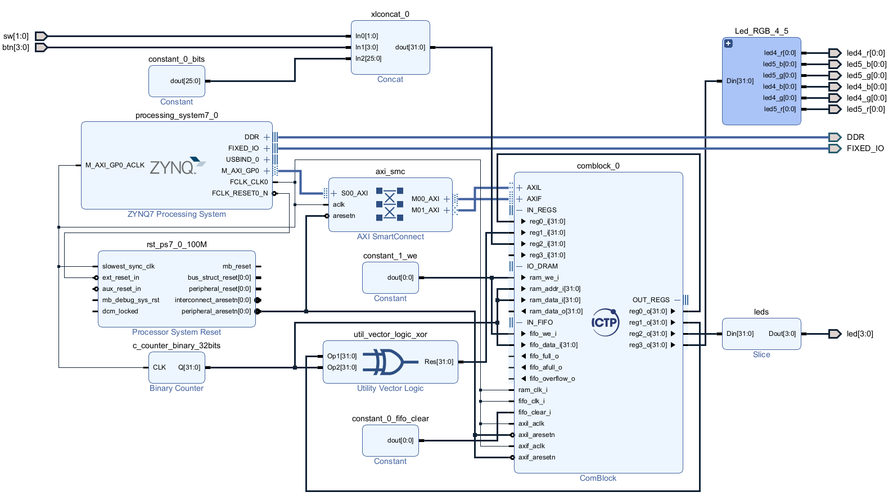

# Core ComBlock at PynQ

This repository provides an example of using Core Comblock with the PYNQ framework to leverage the PYNQ Z1 and Z2 boards. It includes a Tcl script for rebuilding the project in **Vivado 2023.2**, an overlay of a basic project, constaint files, and a notebook for use in Jupyter Notebook within the PYNQ framework.

## Getting Started

This repository includes a submodule from the repository [Core ComBlock](https://gitlab.com/ictp-mlab/core-comblock). To use it within the project, you must run the following commands.

1. Clone the repo
   ```sh
   git clone https://github.com/Mballina42/PynQ_ComBlock.git
   ```
2. Initiate submodules
   ```sh
   git submodule init
   ```
3. Update submodules
   ```sh
   git submodule update
   ```

## Vivado Project

To reproduce any project for the PYNQ Z1 or Z2 boards from Vivado using command-line Tcl, follow these steps:

1. Navigate to the directory containing the Tcl script.
2. Execute the Tcl script provided to rebuild the project.
   ```sh
   source ./prj_pynq_z2_comblock.tcl
   ```
3. You will obtain a block design as follows:


## PYNQ framework

To use in the PYNQ framework with Jupyter Notebook, the repository includes two folders:

- overlays: Contains `.bit` and `.hwh` files necessary for uploading to the board.
- src: Includes *comblock.py*, which defines registers for the Comblock IP, and *pynqCB.ipynb*, a notebook with examples demonstrating how to use the Comblock IP.